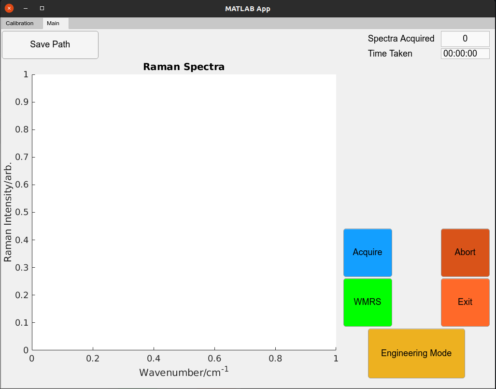

# Proscope Raman Module GUI
Matlab code to contorl the laser, spectrometer and grating for the Proscope project.



# Style Guide

The style guide has been loosly based uponthe exported m file from the app designer code and augmented with Google's C++ [style guide](https://google.github.io/styleguide/cppguide.html).
Clean code by Robert Cecil Martin has also been followed.

## Variable names

lower case, snake case

```
table_name = "table 1";
CCD_temperature = 70 % degrees celsius;
```

### Constants

Upper case whole word, snake case. Like the following:

```
A_CONSTANT = 10;
UART_ERROR = (0x03);
```

## Functions

Camel case (lowercase first word) in the following style:

```
function myOutput = myFunction(x)
.
.
.
end
```

## Classes

## Class Names

Camel case (uppercase first word) in the following style

```
classdef BasicClass
.
.
.
end
```

## Class functions

Camel case (lower case first word) in the following style:

```
app.createComponents()
app.checkReady()
```

## Class Members

Camel case (uppercase first word) in the following style:

```
app.AquireButton = ...
app.SavePathButton = ...
```